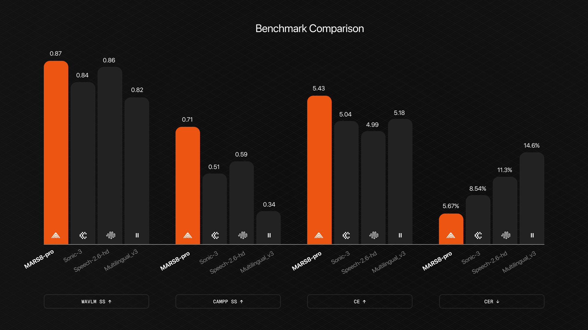
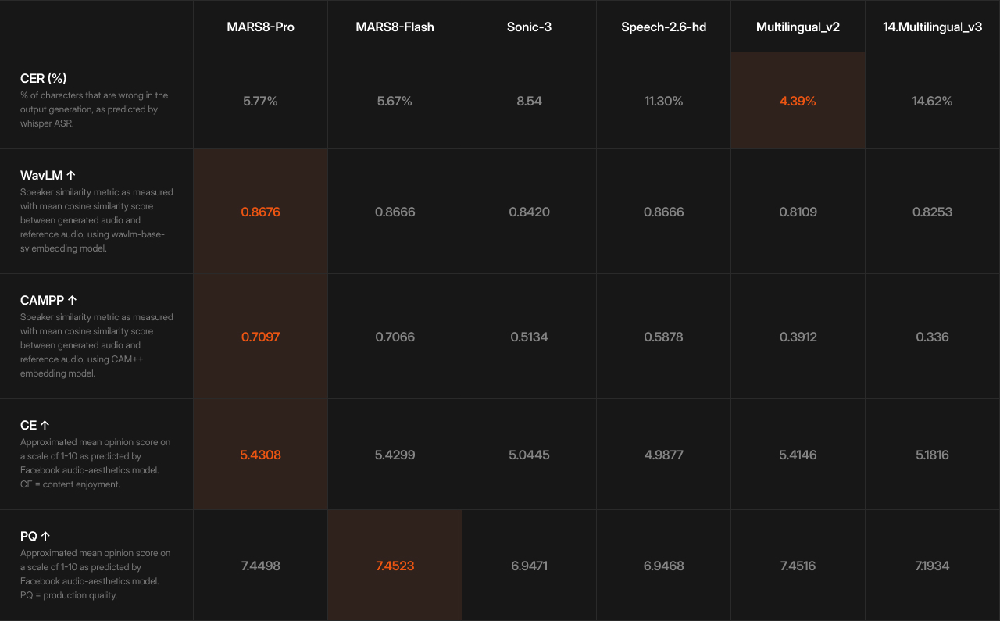

<p align="center">
  <a href="https://camb.ai">
    
  </a>
</p>

<p align="center">
  <picture>
    <source media="(prefers-color-scheme: dark)" srcset="assets/banner-dark.svg">
    <source media="(prefers-color-scheme: light)" srcset="assets/banner-light.svg">
    
  </picture>
</p>

<p align="center">
  <strong>State-of-the-art voice cloning from 2-second references</strong>
</p>

<p align="center">
  <a href="#overview"></a>&nbsp;
  <a href="#performance"></a>&nbsp;
  <a href="#benchmark"></a>&nbsp;
  <a href="#methodology"></a>&nbsp;
  <a href="#citation"></a>
</p>

<br>

<p align="center">
  
</p>

<br>

## Overview

**MARS8** achieves state-of-the-art speech quality and speaker similarity in text-to-speech synthesis, excelling in challenging real-world voice cloning scenarios with minimal reference audio.

Evaluated head-to-head against leading TTS systems — **Cartesia Sonic-3**, **ElevenLabs Multilingual v2/v3**, and **Minimax Speech-2.6-HD** — MARS8 delivers top-tier results across all key metrics while maintaining exceptional voice fidelity from references as short as **2 seconds**.

<br>

## Performance

<p align="center">
  
</p>

<details>
<summary><strong>View detailed metrics</strong></summary>

<br>

### Speech Quality

| Metric | MARS8-Pro | MARS8-Flash | Sonic-3 | Speech-2.6-HD | Multilingual v2 | Multilingual v3 |
|:-------|:---------:|:-----------:|:-------:|:-------------:|:---------------:|:---------------:|
| **CE** ↑ | **5.43** | 5.43 | 5.04 | 4.99 | 5.41 | 5.18 |
| **PQ** ↑ | 7.45 | **7.45** | 6.95 | 6.95 | 7.45 | 7.19 |

### Voice Cloning Accuracy

| Metric | MARS8-Pro | MARS8-Flash | Sonic-3 | Speech-2.6-HD | Multilingual v2 | Multilingual v3 |
|:-------|:---------:|:-----------:|:-------:|:-------------:|:---------------:|:---------------:|
| **CER** ↓ | 5.77% | **5.67%** | 8.54% | 11.30% | 4.39% | 14.62% |

### Speaker Similarity

| Metric | MARS8-Pro | MARS8-Flash | Sonic-3 | Speech-2.6-HD | Multilingual v2 | Multilingual v3 |
|:-------|:---------:|:-----------:|:-------:|:-------------:|:---------------:|:---------------:|
| **WavLM** ↑ | **0.8676** | 0.8666 | 0.8420 | 0.8666 | 0.8109 | 0.8253 |
| **CAM++** ↑ | **0.7097** | 0.7066 | 0.5134 | 0.5878 | 0.3912 | 0.336 |

</details>

<br>

> **Key finding:** MARS8 achieves state-of-the-art speaker similarity even with audio references as short as 2 seconds — a critical advantage for real-world applications where long, clean reference audio is rarely available.

<br>

## Benchmark

### TeaserTTS: A Realistic Dubbing Stress Test

The **TeaserTTS Benchmark** evaluates TTS systems under real-world dubbing constraints, not idealized studio conditions.

| Statistic | Value |
|:----------|:-----:|
| Total samples | 1,334 |
| Cross-language pairs | 70% |
| Average reference duration | 2.3s |
| Most common reference length | 2.0s |
| Total source audio | 101 min |
| Speech-only segments | 51 min |

<br>

### Why TeaserTTS?

Traditional TTS benchmarks rely on clean, long-form reference audio in controlled conditions. TeaserTTS challenges this by introducing:

- **Cross-language voice cloning** — 70% of samples require cloning across different languages, testing pronunciation robustness and identity preservation
- **Ultra-short references** — Average reference duration of just 2.3 seconds mirrors real-world constraints
- **Expressive source audio** — References contain natural expressiveness rather than neutral read speech

<br>

## Results

MARS8 demonstrates consistent superiority across the evaluation dimensions that matter most for production deployments:

| Capability | MARS8 Advantage |
|:-----------|:----------------|
| **Minimal reference requirements** | High-fidelity cloning from 2s audio |
| **Cross-language robustness** | Strong performance on 70% cross-lingual test set |
| **Pronunciation accuracy** | 5.67% CER on multilingual content |
| **Speaker identity preservation** | 0.87 WavLM / 0.71 CAM++ similarity scores |

<br>

## Methodology

All evaluations follow standardized protocols to ensure reproducibility:

| Metric | Method |
|:-------|:-------|
| **Speaker similarity** | WavLM and CAM++ speaker verification models |
| **Transcription accuracy** | Character Error Rate (CER) via Whisper ASR |
| **Quality assessment** | CE and PQ scores via Facebook audio-aesthetics model |

The evaluation data, cleaning pipeline, and metric definitions are fully open-sourced.

<br>

## References

| # | System | Link |
|:-:|:-------|:-----|
| 1 | Cartesia Sonic-3 | [cartesia.ai](https://cartesia.ai/) |
| 2 | ElevenLabs Multilingual v2/v3 | [elevenlabs.io](https://elevenlabs.io/) |
| 3 | Minimax Speech-2.6-HD | [minimax.io](https://www.minimax.io/) |

<br>

## Citation

If you use this benchmark in your research, please cite:

```bibtex
@misc{mars8_2026,
  title   = {MARS8: State-of-the-art Text-to-Speech with Minimal Reference Audio},
  author  = {Camb.ai},
  year    = {2026},
  url     = {https://github.com/Camb-ai/TeaserTTS-benchmark}
}
```

<br>

## License

This project is licensed under the MIT License — see [LICENSE](LICENSE) for details.

---

<p align="center">
  <a href="https://camb.ai"><strong>camb.ai</strong></a>
</p>
